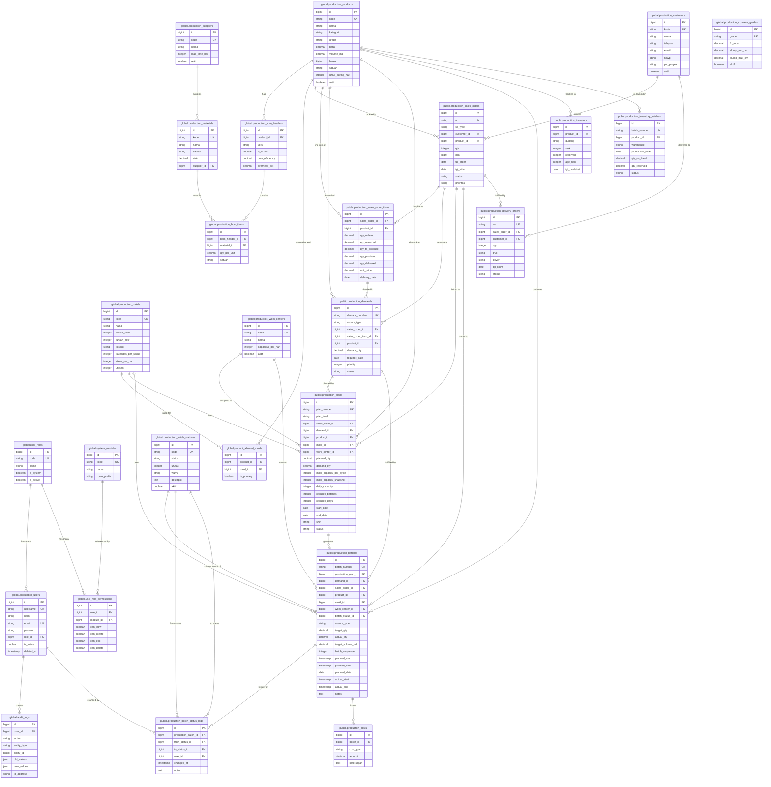

# 🏭 MES Beton Precast — Arsitektur Sistem & Database

> **Manufacturing Execution System** untuk pabrik beton precast.  
> Stack: **Laravel 11** (backend) · **React** (frontend) · **PostgreSQL** (database, multi-schema)

---

## 📐 Desain Database: Dua Schema

Sistem menggunakan **dua PostgreSQL schema** yang terpisah secara fungsi:

| Schema | Fungsi | Contoh Tabel |
|--------|--------|-------------|
| `global` | **Master Data** — data referensi yang jarang berubah | `production_products`, `production_batch_statuses`, `production_molds` |
| `public` | **Transaksi** — data operasional harian yang terus berubah | `production_batches`, `production_sales_orders`, `production_inventory` |

> **Aturan penting**: Tabel di `public` selalu **mereferensi** tabel di `global`, TIDAK sebaliknya.

---

## 🗂️ Daftar Lengkap Tabel

### Schema `global` — Master Data

| Tabel | Deskripsi |
|-------|-----------|
| `global.production_users` | User sistem (login, role, akses modul) |
| `global.user_roles` | Role: super_admin, admin, ppic, operator, dll |
| `global.user_role_permissions` | Mapping role → modul → izin (view/create/edit/delete) |
| `global.system_modules` | Daftar modul sistem yang bisa dikontrol aksesnya |
| `global.production_products` | Katalog produk beton precast (PC Pile, U-Ditch, dll) |
| `global.production_product_categories` | Kategori produk |
| `global.production_product_types` | Tipe/varian produk |
| `global.production_product_specs` | Spesifikasi teknis produk |
| `global.production_concrete_grades` | Mutu beton: K-250, K-300, K-350, K-400 |
| `global.production_materials` | Bahan baku (semen, pasir, besi, dll) |
| `global.production_material_categories` | Kategori material |
| `global.production_suppliers` | Data pemasok material |
| `global.production_customers` | Data pelanggan |
| `global.production_bom_headers` | Bill of Materials header per produk per versi |
| `global.production_bom_items` | Detail BOM: komposisi material per produk |
| `global.production_molds` | Data cetakan (jumlah, kapasitas per siklus) |
| `global.product_allowed_molds` | Mapping produk → cetakan yang diizinkan |
| `global.production_work_centers` | Work center / lini produksi |
| `global.production_shifts` | Data shift kerja (supervisor, jam kerja) |
| `global.production_warehouses` | Daftar gudang |
| `global.production_batch_statuses` | **Master Status Batch** — urutan status yang dikonfigurasi |
| `global.production_statuses` | Status produksi umum |
| `global.production_delivery_statuses` | Status pengiriman |
| `global.production_qc_parameters` | Parameter QC (kuat tekan, slump, dll) |
| `global.production_defect_categories` | Kategori defect (Kritis, Mayor, Minor) |
| `global.audit_logs` | Log seluruh aksi user di sistem |

### Schema `public` — Transaksi

| Tabel | Deskripsi |
|-------|-----------|
| `public.production_sales_orders` | Sales Order dari pelanggan |
| `public.production_sales_order_items` | Line item SO: produk, qty, harga |
| `public.production_demands` | Demand produksi (dari SO atau MTS) |
| `public.production_plans` | Rencana produksi (MPS/Weekly/Daily), mold-centric |
| `public.production_batches` | **Batch produksi aktual** — unit eksekusi terkecil |
| `public.production_batch_status_logs` | Histori perubahan status setiap batch |
| `public.production_inventory` | **Stok agregat** barang jadi per produk per gudang |
| `public.production_inventory_batches` | Lot stok detail per batch produksi |
| `public.production_delivery_orders` | Surat Jalan / Delivery Order |
| `public.stock_reservations` | Reservasi stok untuk SO yang akan dipenuhi |
| `public.production_costs` | Biaya produksi per batch |

---

## 📊 Entity Relationship Diagram (ERD)



---

## 🔄 Alur Sistem End-to-End

Berikut adalah bagaimana sebuah pesanan mengalir melalui sistem dari awal hingga pengiriman:

```
┌──────────────┐    ┌──────────────┐    ┌──────────────┐    ┌──────────────┐
│  Sales Order │───▶│   Demand     │───▶│ Prod. Plan   │───▶│    Batch     │
│  (MTO/MTS)  │    │  Generation  │    │ (PPIC/MOLD)  │    │  Execution   │
└──────────────┘    └──────────────┘    └──────────────┘    └──────────────┘
                                                                    │
                         ┌──────────────────────────────────────────┤
                         ▼                           ▼              ▼
                  ┌──────────────┐          ┌──────────────┐  ┌──────────────┐
                  │  Inventory   │          │ Status Log   │  │  Delivery    │
                  │  (WH-FG)     │          │  (Histori)   │  │   Order      │
                  └──────────────┘          └──────────────┘  └──────────────┘
```

### Tahap 1: Sales Order → Demand
```
[public.production_sales_orders]
  ↓ PPIC "Generate Demand"
[public.production_demands]
  - source_type = 'Sales Order' | 'MTS'
  - status: Open → Planned → Fulfilled
```

### Tahap 2: Demand → Production Plan
```
[public.production_demands]
  ↓ PPIC "Schedule Production" (pilih Mold + Shift + Tanggal)
[public.production_plans]
  - mold_id → global.production_molds
  - daily_capacity = mold.jumlah_aktif × mold.kapasitas_per_siklus × mold.siklus_per_hari
  - required_batches = CEIL(demand_qty / daily_capacity)
  - required_days = CEIL(demand_qty / daily_capacity)
```

### Tahap 3: Production Plan → Batch (Auto-Generate)
```
[public.production_plans]
  ↓ "Auto Generate Batch" (satu plan → N batch)
[public.production_batches]
  - batch_number: BATCH-YYYYMMDD-XXXX
  - batch_sequence: 1, 2, 3, ... N
  - batch_status_id → global.production_batch_statuses (status pertama aktif)
  - target_qty = mold.kapasitas_per_siklus (atau sisa demand)
```

### Tahap 4: Batch Execution (Status Machine)

Ini adalah **inti dari Production Execution**. Status batch diatur oleh `global.production_batch_statuses` yang dikonfigurasi admin.

```
global.production_batch_statuses (urutan wajib diikuti):

  urutan=1: Planning   (warna: abu-abu)  ── Status awal batch
  urutan=2: Casting    (warna: biru)     ── Pencetakan aktif
  urutan=3: QC         (warna: ungu)     ── Quality Control
  urutan=4: Finished   (warna: hijau)    ── Selesai produksi ✓ TRIGGER INVENTORY
  urutan=5: Delivered  (warna: teal)     ── Sudah dikirim   ✓ TRIGGER DELIVERY ORDER

[Jika Curing diaktifkan admin → akan masuk di antara Casting dan QC]
```

**Aturan Transisi (BatchTransitionService):**
1. Hanya bisa maju ke status berikutnya (strictly sequential berdasarkan `urutan`)
2. Status yang `aktif=false` di-skip secara otomatis
3. Tidak bisa loncat langsung (misal dari Planning ke Finished)
4. Setiap transisi dicatat di `public.production_batch_status_logs`

### Tahap 5: Side Effects Otomatis

#### ✅ Ketika batch → **Finished** (keyword: `finished`, `selesai`)
```sql
-- Tambah stok agregat
UPDATE public.production_inventory
   SET stok = stok + actual_qty
 WHERE product_id = batch.product_id AND gudang = 'WH-FG';

-- Buat record lot stok
INSERT INTO public.production_inventory_batches
  (batch_number, product_id, warehouse, production_date, qty_on_hand, status)
VALUES (batch.batch_number, ..., 'WH-FG', NOW(), actual_qty, 'Available');
```

#### 🚚 Ketika batch → **Delivered** (keyword: `delivered`, `kirim`)
```sql
-- Auto-buat Delivery Order
INSERT INTO public.production_delivery_orders
  (no, sales_order_id, customer_id, qty, tgl_kirim, status)
VALUES ('DO-YYYYMMDDHHIISS-NNNN', ..., NOW(), 'Selesai');

-- Kurangi stok agregat
UPDATE public.production_inventory
   SET stok = stok - actual_qty
 WHERE product_id = batch.product_id AND gudang = 'WH-FG';

-- Kurangi lot stok
UPDATE public.production_inventory_batches
   SET qty_on_hand = qty_on_hand - actual_qty
 WHERE batch_number = batch.batch_number;
```

---

## 🔑 Tabel Kunci: `global.production_batch_statuses`

Ini adalah tabel yang **paling penting** dalam sistem karena mengontrol seluruh alur eksekusi.

```sql
-- Contoh data aktual dalam tabel (dapat dikonfigurasi oleh admin)
id | kode  | status    | urutan | warna   | aktif
---+-------+-----------+--------+---------+------
1  | BS-01 | Planning  |   1    | #9E9E9E | true
2  | BS-02 | Casting   |   2    | #2196F3 | true
3  | BS-07 | Curing    |   4    | #00BCD4 | false  ← non-aktif = di-skip
4  | BS-03 | QC        |   5    | #9C27B0 | true
5  | BS-04 | Finished  |   6    | #4CAF50 | true
6  | BS-05 | Delivered |   7    | #009688 | true
```

> **Admin dapat:**
> - Menambah status baru (misal: "Ready Material" sebelum Casting)
> - Menonaktifkan status yang tidak diperlukan (misal: Curing → `aktif=false`)
> - Mengubah nama status (sistem mendeteksi via keyword, bukan ID hardcoded)
> - Mengubah warna badge untuk setiap status

---

## 🏗️ Arsitektur Aplikasi (Backend)

```
app/
├── Http/Controllers/Api/
│   ├── ProductionBatchController.php     ← CRUD + transisi status batch
│   ├── ProductionPlanningController.php  ← PPIC workflow (demand, plan, schedule)
│   ├── SalesOrderController.php          ← Manajemen SO
│   ├── InventoryController.php           ← Stok barang jadi
│   ├── DeliveryOrderController.php       ← Surat jalan
│   └── MasterData/
│       ├── BatchStatusController.php     ← Konfigurasi status batch
│       ├── ProductController.php
│       ├── MoldController.php
│       └── ...
│
├── Services/
│   ├── BatchTransitionService.php        ← State machine transisi status
│   └── ProductionPlanningService.php     ← Logika kalkulasi demand & kapasitas
│
├── Models/
│   ├── ProductionBatch.php               ← Model batch utama
│   ├── BatchStatus.php                   ← Model global.production_batch_statuses
│   ├── BatchStatusLog.php                ← Model histori transisi
│   ├── ProductionPlan.php
│   ├── ProductionDemand.php
│   ├── SalesOrder.php
│   ├── Inventory.php
│   ├── InventoryBatch.php
│   └── DeliveryOrder.php
│
└── Observers/
    └── ProductionBatchObserver.php       ← Auto-sync status SO saat batch berubah
```

---

## 📱 Modul Frontend (React)

| Modul | Path | Fungsi |
|-------|------|--------|
| **Sales Order** | `/sales-order` | Input & manajemen pesanan pelanggan |
| **Production Planning** | `/production-planning` | PPIC workflow: demand → plan → jadwal |
| **Production Execution** | `/production-execution` | Dashboard monitoring batch, Kanban status |
| **Inventory** | `/inventory` | Stok barang jadi WH-FG |
| **Delivery** | `/delivery` | Surat jalan & pengiriman |
| **Master Data** | `/master/*` | Konfigurasi: produk, cetakan, status, user |

---

## 🔐 Sistem Akses (RBAC)

```
global.user_roles (Role)
  ↓
global.user_role_permissions (Permission per Modul)
  ↓
global.system_modules (Modul yang bisa dikontrol)
```

**Role bawaan:**
- `super_admin` — akses penuh semua modul
- `admin` — kelola master data
- `ppic` — production planning & scheduling
- `operator` — production execution (hanya update status)
- `qc` — quality control
- `logistik` — delivery & inventory

---

## 🔍 Query Penting

### Melihat semua batch aktif beserta status saat ini
```sql
SELECT 
    pb.batch_number,
    pp.nama AS produk,
    pbs.status AS status_saat_ini,
    pbs.warna,
    pb.target_qty,
    pb.actual_qty,
    pb.planned_date
FROM public.production_batches pb
JOIN global.production_products pp ON pp.id = pb.product_id
JOIN global.production_batch_statuses pbs ON pbs.id = pb.batch_status_id
WHERE pbs.status NOT IN ('Delivered')
ORDER BY pb.planned_date, pbs.urutan;
```

### Melihat histori transisi satu batch
```sql
SELECT 
    from_s.status AS dari,
    to_s.status AS ke,
    u.name AS diubah_oleh,
    pbl.changed_at,
    pbl.notes
FROM public.production_batch_status_logs pbl
LEFT JOIN global.production_batch_statuses from_s ON from_s.id = pbl.from_status_id
JOIN global.production_batch_statuses to_s ON to_s.id = pbl.to_status_id
LEFT JOIN global.production_users u ON u.id = pbl.user_id
WHERE pbl.production_batch_id = :batch_id
ORDER BY pbl.changed_at;
```

### Stok agregat barang jadi saat ini
```sql
SELECT 
    pp.kode,
    pp.nama,
    pi.stok,
    pi.reserved,
    (pi.stok - pi.reserved) AS stok_tersedia,
    pi.tgl_produksi
FROM public.production_inventory pi
JOIN global.production_products pp ON pp.id = pi.product_id
WHERE pi.gudang = 'WH-FG'
ORDER BY pp.kode;
```

---

## 📌 Catatan Penting & Konvensi

> [!IMPORTANT]
> **JANGAN hardcode status ID atau nama status** di kode PHP/JS.  
> Selalu query `global.production_batch_statuses` dan gunakan keyword semantik (`finished`, `casting`, `delivered`) untuk deteksi jenis status.

> [!NOTE]
> **Urutan kolom `urutan`** di `global.production_batch_statuses` adalah yang menentukan alur. Admin yang mengonfigurasi urutan ini. Sistem secara otomatis mengikuti urutan yang terdaftar dan aktif.

> [!TIP]
> Untuk menambah tahap produksi baru (misal: "Pre-Stressing"), cukup tambahkan baris baru di `global.production_batch_statuses` dengan `urutan` yang sesuai. Sistem akan otomatis menyesuaikan validasi transisi tanpa perubahan kode.

> [!WARNING]
> Tabel `public.production_inventory` menggunakan **unique constraint** `(product_id, gudang)`. Hanya ada **satu baris per produk per gudang** untuk stok agregat. Detail per lot ada di `production_inventory_batches`.
